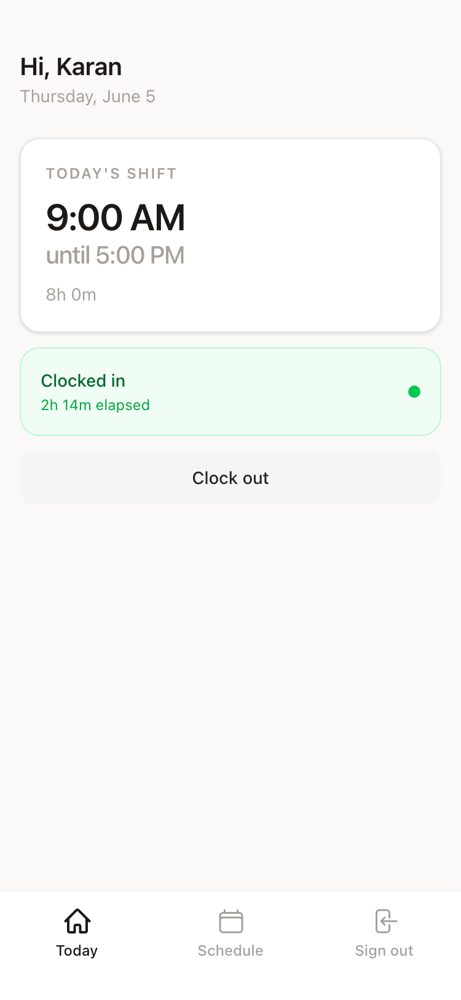
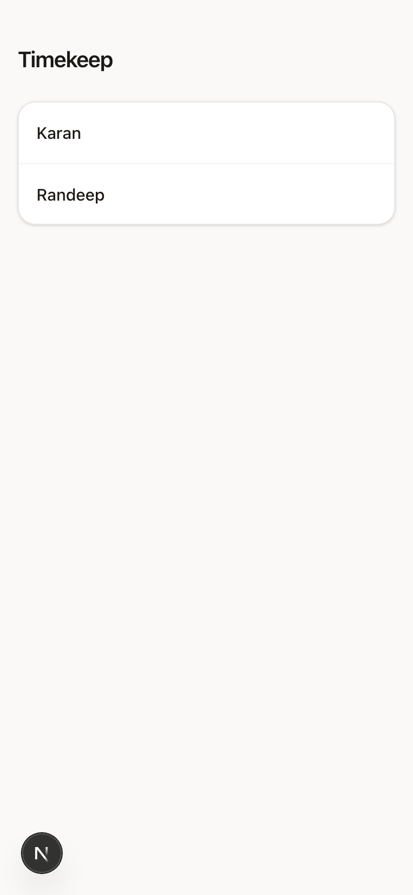
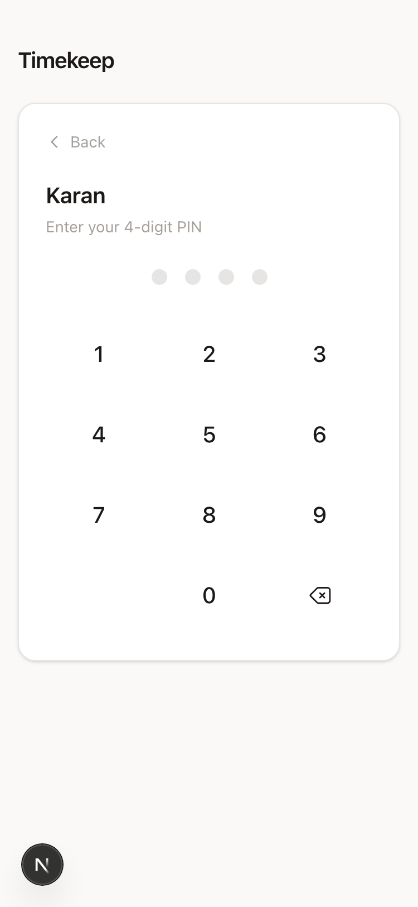
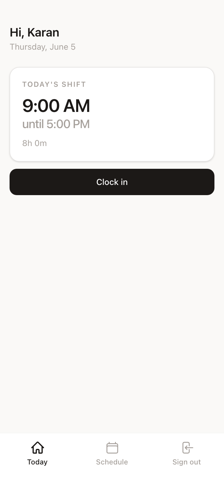
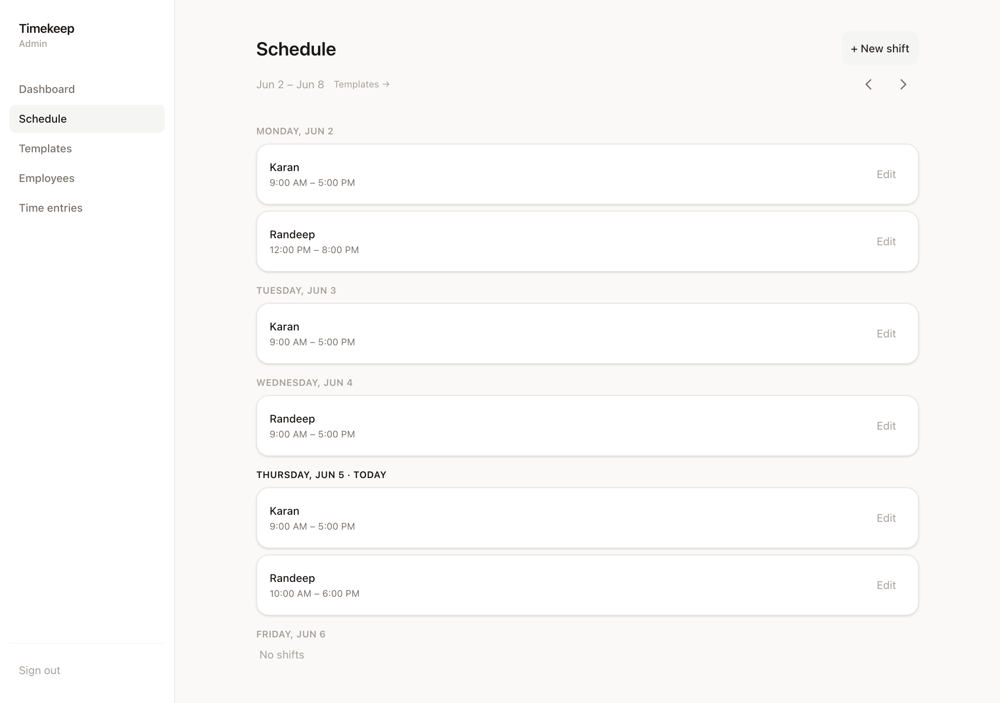
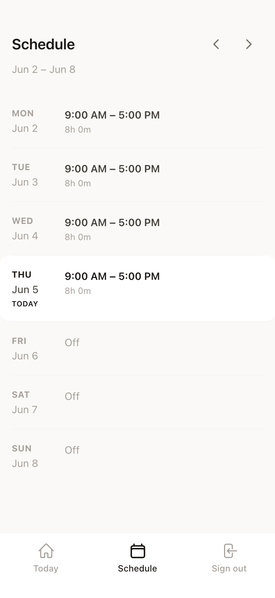
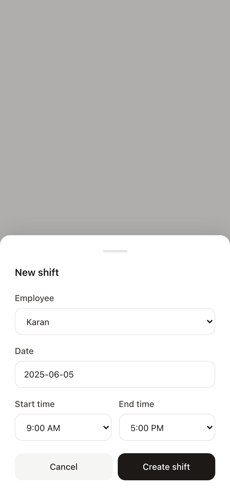

# Timekeep

Mobile-first workforce scheduling and time tracking for small operational teams.

 

<!-- Hero screenshot — full-width, mobile-framed dashboard showing today's shift card and clock-in button -->

  

 

**[Live deployment](#)** · **[Video walkthrough](#)**

`Next.js` &nbsp;`TypeScript` &nbsp;`Tailwind` &nbsp;`Supabase` &nbsp;`Vercel`

---

## Philosophy

Scheduling software built for HR is the wrong tool for a five-person team. The real problem is simpler: employees need to clock in from a parking lot, managers need to know who's active right now, and a missed clock-out shouldn't require a support conversation.

Timekeep was designed around that. Not around what a workforce management product is *supposed* to include — around what this specific operational problem actually requires.

The employees using this app work with their hands. Their phone is in their pocket between tasks. The product needs to open, do the thing, and get out of the way. That constraint shaped every design decision: one-tap clock-in, PIN auth instead of passwords, a schedule that reads in under three seconds, modals that anchor to the bottom of the screen where thumbs actually are.

The goal was software that earns trust through reliability and restraint, not through feature count.

---

## Product

### Employee

On login, the employee selects their name and enters a four-digit PIN. No email, no password, no reset flow. The dashboard opens to today's shift. One tap to clock in; one tap to clock out. An elapsed timer runs while the shift is active.

If an employee forgets to clock out, the dashboard surfaces a correction flow the next morning — they select their departure time without involving a manager. The weekly schedule view shows the full week at a glance, with navigation for past and future weeks.

### Admin

The admin schedule is a weekly view across all employees. Shifts are created inline, edited by tapping through to a form, and deleted from the same place. A weekly template system handles recurring patterns: set each person's standard week once, then apply it to any week in two taps and adjust from there.

Time entries are the ground truth — every clock-in and clock-out, with durations, editable by the admin. Corrections happen directly in the entry, not through a separate workflow.

Employee management covers creation, PIN reset, and deactivation. Deactivated employees retain their history; they simply can't sign in.

---

## Screenshots

<!-- 3 mobile screens side by side — login name picker, PIN keypad, employee dashboard -->

  
  &nbsp;&nbsp;
  
  &nbsp;&nbsp;
  

 

<!-- Full-width admin schedule — desktop or wide mobile, weekly layout -->

  

 

<!-- 2 mobile screens side by side — employee weekly schedule, bottom-sheet new shift modal -->

  
  &nbsp;&nbsp;
  

---

## Engineering

**Server Components and Server Actions** handle the majority of the application's work. Data is fetched at the server, passed to leaf-level client components only where interactivity requires it. There's no client-side data-fetching library, no global state manager, no cache layer to reason about. The data flow is direct: page loads, server fetches, component renders. Mutations go through Server Actions, which call `revalidatePath` and let Next.js handle invalidation.

**Row Level Security enforced at the database.** Authorization is a database guarantee, not application logic. Employees can read only their own shifts and time entries; admins have full access. This holds regardless of any application-level mistake. The RLS policies use a `is_admin()` security-definer function to avoid the recursive evaluation problem that occurs when an admin policy queries the `employees` table to check if the current user is an admin.

**Employee UUID = Auth UUID.** Each employee row's primary key is the Supabase Auth user ID. There's no join between an identity layer and a users table — one row, one identity, no desync risk.

**No realtime.** A five-person team doesn't need WebSocket infrastructure. Clock-in state is accurate within one page navigation. The operational cost of maintaining a realtime system is not justified by the problem.

**`<select>` over `<input type="time">`.** iOS Safari renders time inputs as blank boxes until tapped — there's no visible current value. The native `<select>` triggers the iOS wheel picker immediately and always shows what's selected. A shared `TimeSelect` component generates 15-minute interval options across all time fields in the product.

---

## Mobile UX

The product is designed to be used during a shift — quickly, on a personal phone, often with one hand.

Every interactive element meets the 44px minimum touch target. Bottom-sheet modals anchor to the viewport bottom, placing controls within thumb reach. Sheet entrances animate in on a fast-deceleration curve (240ms) that communicates spatial context without registering as visible animation. `viewportFit: cover` and `env(safe-area-inset-*)` handle iPhone notch and home indicator geometry correctly across all layouts. The 300ms tap delay is eliminated globally via `touch-action: manipulation`.

The PIN keypad replaces typed input entirely — no keyboard, no autocorrect, no zoom-on-focus. Digit buttons give immediate scale feedback on press. The fourth PIN digit triggers authentication without a submit button.

Information hierarchy is optimized for scanning, not reading. On the employee dashboard, the shift time is the largest element on the screen. On the schedule, today is visually anchored. The goal is that the operationally relevant information is visible before the user consciously looks for it.

---

## Scope

What was intentionally excluded, and why.

**Analytics and usage tracking.** Data about employees that reflects back on them as performance metrics creates a different kind of product — one the user is working *for*, not *with*. The admin view shows operational state: who's scheduled, who's clocked in. Not charts.

**Realtime synchronization.** For this scale, a page load is sufficient. The infrastructure overhead of a realtime system — connection management, presence, conflict resolution — would outlast its justification.

**Payroll integration.** Time entries are records. What gets done with them belongs to a separate system with separate compliance requirements. Scope capture in this direction would make the product harder to maintain and easier to misuse.

**AI-assisted scheduling.** Automated scheduling would move control away from the manager who holds context that doesn't exist in the data — who's reliable for opening shifts, who's training, what the week actually looks like. Adding automation here would reduce trust, not friction.

**Push notifications.** Valuable in theory; significant infrastructure in practice. The communication patterns of a small operational team don't require it, and adding it would create maintenance surface for a marginal benefit.

---

## Technical overview

| | |
|---|---|
| **Frontend** | Next.js App Router, TypeScript, Tailwind CSS |
| **Backend** | Supabase — PostgreSQL, Auth, Row Level Security |
| **Deployment** | Vercel, automatic on push to `main` |
| **Authentication** | PIN-based via `signInWithPassword` with derived email identity |
| **Data flow** | Server Components fetch · Server Actions mutate · `revalidatePath` invalidates |
| **Schema** | Three tables: `employees`, `shifts`, `time_entries` |

Route protection is handled in middleware and reinforced by RLS. `/login` is public. `/dashboard` and `/schedule` require an authenticated session. `/admin/*` requires admin role — checked in middleware, guaranteed by database policy.

---

## Demo

**Deployment:** [timekeep.vercel.app](#)

**Walkthrough:** A recorded walkthrough should cover the complete flow — employee name selection → PIN entry → clock in → schedule view → admin shift creation → template application → time entry correction. 90 seconds is enough. Record on actual hardware, not a browser simulator. The safe-area handling, native pickers, and sheet animations read differently on a real device.

---

## On operational software

The easiest thing to do when building software is add. The dashboard, the analytics, the notification system — each feels like progress and each makes the product harder to use for the people it exists to serve.

The constraint here was real: a small team needed to track their hours reliably on their phones. Solving that problem well meant resisting the version of the product that solved it plus twenty adjacent problems that nobody asked for.

The result is software that does a specific thing cleanly. It can be maintained by one person, understood in an afternoon, and trusted to work correctly under the conditions it was designed for. That's the goal.
